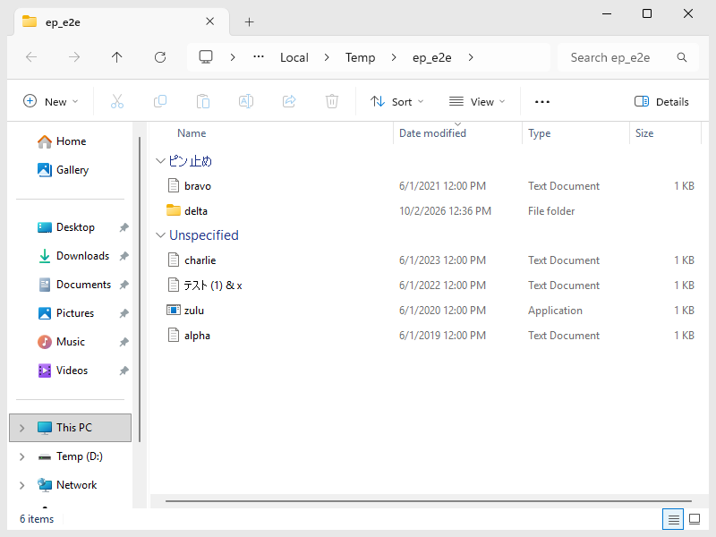

# Explorer Pinned 📌

Windows のエクスプローラーで、よく使うファイルやフォルダーを **フォルダーの一番上にピン止め** できる無料ツールです。
ダウンロードフォルダーなどで、名前順・更新日時順のどちらで並べても、ピン止めした項目は常に一番上の
「**∨ ピン止め**」グループに表示されます。



*更新日時の新しい順に並べても、ピン止めした項目は一番上の「ピン止め」グループに表示されます。
（自動テスト環境の画面です。Windows が英語のため、もう一方のグループ名が「Unspecified」になっています。日本語の Windows では「未指定」と表示されます。）*

English summary is [below](#english).

## 特長

- 右クリック →「**このファイルをピン止めする**」/「**このフォルダーをピン止めする**」でピン止め
- ピン止めした項目は「ピン止め」グループとして一番上に表示（名前順・更新日時順・サイズ順など、どの並べ替えでも一番上）
- 右クリック →「**ピン止めを外す**」で解除
- ダウンロードに限らず、どのフォルダーでも使えます
- **ファイルを開く・保存する画面や、ブラウザーでファイルをアップロードするときの画面** でも一番上に表示（インストーラー版、[詳しく](#ファイル選択画面開く保存アップロード)）
- ウィンドウの「**ピン止め オン / オフ**」ボタンで、いつでも普段の表示に戻せます（ピン止めは残ります、[詳しく](#オンオフ-ボタン)）
- エクスプローラー本体は書き換えません（エクスプローラーのウィンドウは Windows が公開している COM の API だけで操作します）
- ファイル自体には何も書き込みません（名前も更新日時も変わりません）
- 日本語と英語に対応（インストーラーで選んだ言語。ポータブル版は Windows の表示言語）
- 無料・オープンソース（MIT ライセンス）

## 動作環境

- Windows 10 / Windows 11（x64 / ARM64）
- 自動テスト: GitHub Actions 上の Windows Server 2022（Windows 10 と同じエクスプローラー）と
  Windows Server 2025（Windows 11 と同じエクスプローラー）で、本物のエクスプローラーを使って毎回テストしています。
  Windows 10 スタイルの画面は [docs/screenshot-windows10.png](docs/screenshot-windows10.png) を参照してください。

## インストール

1. [Releases](https://github.com/ORCA-IRUKA-222/explorer-pinned/releases) から
   `ExplorerPinned-Setup-<バージョン>.exe` をダウンロードして実行します。
2. 管理者の確認が 1 回表示されます。「ピン止め」グループの名前と、ファイル選択画面用の DLL を Windows に登録するためです。
3. インストールが終わると常駐を開始します（通知領域にピンのアイコンが出ます）。次回からはサインイン時に自動で起動します。

> [!NOTE]
> コード署名をしていないため、「Windows によって PC が保護されました」と表示されることがあります。
> 「詳細情報」→「実行」で続行できます。気になる場合は、このリポジトリのソースから自分でビルドすることもできます。

### ポータブル版（zip）

インストーラーを使わない場合は `ExplorerPinned-<バージョン>-x64.zip`（ARM 版 PC では `-arm64.zip`）を
好きな場所に展開し、`ExplorerPinned.exe` をダブルクリックします。
初回はセットアップの確認が出るので「OK」を押してください（管理者の確認が 1 回出ます）。
セットアップ後に exe を別の場所へ移動した場合は、もう一度ダブルクリックしてセットアップし直してください。
ポータブル版はファイル選択画面（開く・保存・アップロード）には対応していません（インストーラー版を使ってください）。

## 使い方

### ピン止めする

ファイルまたはフォルダーを右クリックして、「このファイルをピン止めする」または「このフォルダーをピン止めする」を選びます。
複数選択してまとめてピン止めすることもできます（Windows の仕様で一度に 15 個まで）。

> [!TIP]
> **Windows 11** では、右クリックで最初に出る短いメニューには表示されません。
> 「**その他のオプションを確認**」を選ぶか、**Shift キーを押しながら右クリック** すると表示されます。

### ピン止めを外す

ピン止め済みの項目を右クリックして「ピン止めを外す」を選びます。
通知領域のアイコン →「ピン止め中の項目」からも外せます。

### 表示のしくみ

- ピン止めした項目があるフォルダーを開くと、エクスプローラーの「グループ化」が自動で「ピン止め」になり、
  ピン止めした項目が一番上の「ピン止め」グループにまとまります。
- それ以外の項目は「未指定」グループに入ります（このグループ名は Windows が決めているため変更できません）。
- 項目が多いフォルダーやネットワーク上のフォルダーでは、エクスプローラーがフォルダーを読み込み終わってから
  ピン止めグループになるため、表示まで数秒かかることがあります。
- 並べ替え（名前・更新日時・種類・サイズなど）は普段どおり自由に変えられます。どの並べ替えでもピン止めグループが一番上です。
- 一時的に別のグループ化（例: 種類）を選ぶと、そのウィンドウではそのまま維持されます。フォルダーを開き直すと「ピン止め」グループに戻ります。
- フォルダー内のピン止めをすべて外すと、元のグループ化（例: ダウンロードの「更新日時」グループ）に戻ります。

### オン/オフ ボタン

ピン止めした項目があるフォルダーでは、ウィンドウに小さな「**📌 ピン止め オン**」ボタンが表示されます。

- **エクスプローラー:** ウィンドウ下端のステータスバーの右側（ステータスバーを非表示にしている場合は一覧の右下）
- **ファイル選択画面:** ファイル一覧の右下（インストーラー版）

クリックすると「ピン止め オフ」になり、**開いているすべてのエクスプローラーとファイル選択画面がまとめて** 普段の表示
（元のグループ化）に戻ります。ピン止めした項目の一覧は残っているので、もう一度クリックすればすぐに元どおり一番上に表示されます。
オフの間にピン止めした項目も、オンに戻したときに表示されます。

- 通知領域のアイコン →「ピン止めグループを表示する」や、コマンドライン（`ExplorerPinned.exe off` / `on`）でも切り替えられます。
- ボタンが邪魔な場合は、通知領域のアイコン →「ウィンドウにオン/オフ ボタンを表示」のチェックを外すと非表示にできます。
- ピン止めした項目がないフォルダーにはボタンは表示されません。

### ファイル選択画面（開く・保存・アップロード）

インストーラー版では、アプリの「ファイルを開く」「名前を付けて保存」の画面や、Chrome・Edge・Firefox などで
Web サイトにファイルをアップロードするときの画面でも、ピン止めした項目が一番上の「ピン止め」グループに表示されます。

- **しくみ:** 小さな DLL（`ExplorerPinnedShell.dll`）を Windows に登録しておくと、Windows 標準のファイル選択画面を表示するアプリが
  その DLL を読み込みます。DLL はファイル選択画面の一覧のグループ化だけを変更し、画面を閉じる前や別のフォルダーへ移る前に
  元のグループ化に戻します。ファイルにもアプリにも何も書き込みません。インターネットへの通信もしません。
  （Windows に「アイコンのオーバーレイ」用として登録しますが、アイコンには何も表示せず、
  Windows のオーバーレイの枠（15 個まで）も使いません。）
- **オフにするには:** 一時的にオフにするだけなら、画面の「ピン止め オン」ボタンを押します（エクスプローラーもまとめてオフになります）。
  ファイル選択画面だけ常にオフにするには、通知領域のアイコン →「ファイル選択画面（開く・保存・アップロード）でも表示」のチェックを外します。
  どちらも開いているファイル選択画面にすぐ反映されます。DLL 自体を取り除くにはアンインストールしてください。
- 32 ビットのアプリにも対応しています。ARM 版 Windows では、ARM64 版と 32 ビット（x86）のアプリで表示されます
  （エミュレーションで動く x64 版のアプリでは表示されません）。
- アプリが独自のファイル選択画面を使っている場合は表示されません。
- インストール（または更新）する前から起動していたアプリでは、そのアプリを終了して起動し直すまで表示されません。
  Windows はアプリが最初にファイルのアイコンを表示するときに DLL の一覧を読み込むためです（通知領域に常駐するアプリは、通知領域のアイコンから終了してください）。
- この DLL はファイル選択画面を表示するすべてのアプリ（管理者として実行したアプリも含む）に読み込まれるため、
  管理者しか変更できない Program Files にインストールした場合だけ登録します。
- コード署名をしていないため、セキュリティソフトによっては「他のアプリに読み込まれる DLL」として警告することがあります。
- 更新時にアプリが DLL を使用中の場合は、古い DLL の名前を変えて新しい DLL を入れ、古い DLL は次回の再起動時に削除します。

### 通知領域（タスクトレイ）のメニュー

| メニュー | 内容 |
| --- | --- |
| ピン止めグループを表示する | ピン止めグループ表示のオン/オフ（ウィンドウのボタンと同じ。ピン止めは残ります） |
| ウィンドウにオン/オフ ボタンを表示 | エクスプローラーとファイル選択画面のオン/オフ ボタンの表示/非表示 |
| ピン止め中の項目 | ピン止めの一覧。各項目から「エクスプローラーで表示」「ピン止めを外す」ができます |
| 開いているウィンドウに再適用 | 表示がずれたときに、開いているすべてのウィンドウへ再適用します |
| 存在しない項目のピン止めを整理 | 削除済みの項目のピン止めを一覧から消します |
| Windows の起動時に開始 | 自動起動のオン/オフ |
| ファイル選択画面（開く・保存・アップロード）でも表示 | ファイル選択画面での表示のオン/オフ（インストーラー版） |
| 終了 | 常駐を終了し、ピン止めグループにしていたフォルダーのグループ化を元に戻します |

### うまく表示されないとき

- 通知領域のアイコン →「開いているウィンドウに再適用」を試してください。
- 「未指定」のグループだけが表示され、ピン止めした項目が上に来ない場合は、最新版をインストールし直してください。
  バージョン 1.0.0 / 1.0.1 の「ピン止め」の登録が二重になっていると起きます（最新版のセットアップが古い登録を削除します）。
- ピン止めグループにできなかったフォルダーは、何度も表示し直すことはせず、元のグループ化に戻します
  （そのフォルダーを開き直すか、ピン止めを変更すると再び試します）。
- 動作の記録が `%LOCALAPPDATA%\ExplorerPinned\agent.log` に保存されています（最大約 1 MB、アンインストールで削除されます）。
  [Issues](https://github.com/ORCA-IRUKA-222/explorer-pinned/issues) で報告していただく際に添付していただけると、原因を調べやすくなります。

## 制限事項

- **常駐プロセスが必要です。** 「ピン止め」グループは常駐中のプロセスがエクスプローラーに指示して表示しています。
  終了中はピン止めグループが表示されません。終了するときは、ピン止めグループにしていたフォルダーのグループ化を元に戻します
  （開いていないフォルダーは裏でいったん開いて戻すため、Windows 11 では最小化されたウィンドウが一瞬表示されます）。
- **グループ化は 1 種類だけです。** ピン止めグループを表示している間は、ダウンロードフォルダー標準の
  「今日」「昨日」といった日付のグループは表示されません（並べ替えは日付順にできます）。
- **ピン止めはパスで記録します。** ピン止めした項目の名前を変えたり別のフォルダーへ移動したりすると、ピン止めは外れます。
  削除した項目と同じ名前の項目が後から作られると、再びピン止めされた状態になります。
- 「PC」「ホーム」「ライブラリ」、検索結果などの仮想フォルダーでは使えません。
- ピン止めしていない項目が入る「未指定」グループの名前は変更できません（Windows の仕様）。
- 同じフォルダーを表示していても、隠しファイルとして非表示になっている項目はピン止めグループに出ません。
- エクスプローラーの `IFolderView2::SetViewProperty` という API を使っています。現在の Windows 10 / 11 で動作しますが、
  Microsoft の SDK では「非推奨」と記載されているため、将来の Windows の更新で動かなくなる可能性があります。

## アンインストール

「設定」→「アプリ」→「インストールされているアプリ」から **Explorer Pinned** をアンインストールします。
右クリックメニュー、自動起動、ピン止めの一覧、Windows に登録した「ピン止め」の名前とファイル選択画面用の DLL がすべて削除され、
ピン止めグループにしていたフォルダーのグループ化も元に戻ります。
アンインストール時にアプリが DLL を使用中の場合、DLL のファイルは次回の再起動時に削除されます。

ポータブル版の場合は、コマンドプロンプトで次を実行してから exe を削除してください。

```bat
ExplorerPinned.exe uninstall
```

## コマンドライン

```text
ExplorerPinned.exe [コマンド] [パス...]

  (コマンドなし)      必要ならセットアップして、常駐を開始
  pin <パス>...       ファイル/フォルダーをピン止め
  unpin <パス>...     ピン止めを外す
  toggle <パス>...    ピン止め/解除を切り替え
  list                ピン止め中の項目を表示
  status              登録・実行の状態を表示
  on | off            ピン止めグループの表示をオン/オフ（すべてのウィンドウとファイル選択画面。ピン止めは残ります）
  reapply             開いているウィンドウに再適用
  setup               右クリックメニュー・「ピン止め」の名前・自動起動を登録
                      (--no-startup: 自動起動を登録しない / --no-agent: 常駐を開始しない / --quiet)
  register-dialogs    ファイル選択画面用の DLL を登録（管理者として実行。インストーラーが実行します）
  uninstall           このプログラムが登録したものをすべて削除 (--quiet)
  exit                常駐を終了
```

## しくみ（開発者向け）

- 常駐プロセスが `IShellWindows` で開いているエクスプローラーのウィンドウ（タブ）を監視します。
- ピン止めした項目があるフォルダーが表示されると、そのビューの `IFolderView2::SetViewProperty` で
  ピン止めした項目に独自のプロパティ値を設定し、`IFolderView2::SetGroupBy` でそのプロパティでグループ化します。
  値はエクスプローラーのビューのキャッシュに入るだけで、ファイルには一切書き込みません。
- エクスプローラーはグループ化のキーが変わったときにだけ項目を振り分け直すため、同じ表示名を持つ 2 つのプロパティを
  交互に使って、ピン止めの変更・F5 更新・ファイルの更新に追従しています。
- グループ名「ピン止め」は、プロパティの説明（`.propdesc`）を `PSRegisterPropertySchema` で登録して表示しています（要管理者）。
  Windows はこの説明ファイルをファイル名で区別するため、インストール版もポータブル版も
  `%ProgramData%\ExplorerPinned\ExplorerPinnedGroup.propdesc` の 1 か所に登録します。
- エクスプローラーはフォルダーごとに表示設定（グループ化を含む）を保存します。ピン止めグループにしたフォルダーは
  `HKCU\Software\ExplorerPinned\GroupedFolders` に記録しておき、常駐の終了時やアンインストール時に、そのフォルダーを
  見えない（または最小化した）ウィンドウでいったん開いて元のグループ化に戻します。
- 右クリックメニューは `HKCU\Software\Classes\*\shell` と `Directory\shell` の静的な項目です。
  `AppliesTo` 条件にピン止め中のパスを入れて、「ピン止めする」と「ピン止めを外す」を出し分けています。
- ピン止めの一覧は `HKCU\Software\ExplorerPinned\Pins` に保存されます。
- ファイル選択画面: `ExplorerPinnedShell.dll`（32 ビットのアプリ用は `ExplorerPinnedShell32.dll`）をアイコンオーバーレイハンドラー
  （`ShellIconOverlayIdentifiers`）として登録すると、シェルのビューを表示するプロセスに読み込まれます。
  `GetOverlayInfo` が失敗を返すためオーバーレイの枠は使いません。エクスプローラー以外のプロセスでは、
  そのプロセスの `#32770`（ファイル選択画面）を監視し、画面のスレッドにフックを入れて、そのスレッドで
  `WM_GETISHELLBROWSER` → `IShellBrowser::QueryActiveShellView` → `IFolderView2` と取得して、エクスプローラーと同じ方法でグループ化します。
  画面はフォルダーごとにグループ化を保存するため、閉じる操作（OK / キャンセル / 閉じる）と
  `IExplorerBrowserEvents::OnNavigationPending`（別のフォルダーへの移動）の前に元のグループ化に戻します。
  ファイル選択画面はウィンドウのイベント（`SetWinEventHook`）で見つけ、ピン止めの変更はレジストリの変更通知で受け取ります。
- 表示の速さ: エクスプローラーがフォルダーを読み込み終えた通知（`DShellFolderViewEvents` の EnumDone）を受けたら、
  すぐにグループ化します。ピン止めの変更はレジストリの変更通知（`RegNotifyChangeKeyValue`）で受け取り、すぐに反映します。
- オン/オフ: `HKCU\Software\ExplorerPinned` の `Enabled`（`0` でオフ）と `Button`（`0` でボタンを非表示）。
  エクスプローラーのボタンは常駐プロセスが、そのウィンドウを所有者にした小さなウィンドウとして表示します
  （所有されたウィンドウは入力をエクスプローラーと共有するため、何も待たない専用のスレッドで動かします）。
  ファイル選択画面のボタンは DLL が画面のスレッドで表示します。

### ビルド

Visual Studio 2022（C++ によるデスクトップ開発）と CMake が必要です。

```bat
cmake -B build -A x64
cmake --build build --config Release
```

`build\Release\ExplorerPinned.exe` と `ExplorerPinnedShell.dll` ができます。ARM64 版は `-A ARM64`、
32 ビットのアプリ用の `ExplorerPinnedShell32.dll` は `-A Win32` で作成できます。

### テスト

`ExplorerPinnedE2E.exe` は、本物のエクスプローラーのウィンドウを開いてピン止めの表示を UI オートメーションで確認する
エンドツーエンドテストです。管理者として実行してください（テスト用のフォルダーを `%TEMP%\ep_e2e` に作り、
最後にこのツールの登録をすべて削除します）。

```bat
build\Release\ExplorerPinnedE2E.exe build\Release\ExplorerPinned.exe
```

GitHub Actions（`.github/workflows/build.yml`）では、push のたびにビルドとこのテストを Windows Server 2022 / 2025 で実行し、
インストーラーと zip を作成します。Releases への公開は、`src/version.h` のバージョンを上げてから
Actions の「Build」→「Run workflow」で `release` にチェックを入れて実行します（`v1.2.3` のようなタグの push でも公開されます）。
コード署名（SignPath）の設定とリリース時の承認の流れは [docs/code-signing.md](docs/code-signing.md) にあります。

## コード署名ポリシー

Windows 用のプログラム（`ExplorerPinned-Setup-<バージョン>.exe`、`ExplorerPinned.exe`、`ExplorerPinnedShell.dll`、
`ExplorerPinnedShell32.dll`）は、SignPath Foundation の証明書で署名します（**申請中**。承認後のリリースから署名されます。
それまでのリリースは署名されていません）。

Free code signing provided by [SignPath.io](https://about.signpath.io/), certificate by [SignPath Foundation](https://signpath.org/).

- 署名するのは、このリポジトリのソースコードから GitHub Actions でビルドしたファイルだけです。
- コミッター・レビュアー: [ORCA-IRUKA-222](https://github.com/ORCA-IRUKA-222)
- 承認者（署名を承認する人）: [ORCA-IRUKA-222](https://github.com/ORCA-IRUKA-222)

**プライバシーポリシー:** このプログラムは、利用者（またはインストール・操作する人）が明示的に求めた場合を除き、
ネットワーク上のほかのシステムに情報を送信しません。

## ライセンス

[MIT License](LICENSE)

---

## English

**Explorer Pinned** pins your favorite files and folders to the top of any folder in Windows File Explorer.
Pinned items are shown in a **"Pinned"** group at the top, whatever the sort order (name, date modified, size, ...).

- Right-click a file or folder → **"Pin this file to the top"** / **"Pin this folder to the top"**; **"Unpin from the top"** to remove.
  On Windows 11 these items are under **"Show more options"** (or Shift + right-click).
- Works in every regular folder, e.g. Downloads. Files are never modified; Explorer is not patched.
- With the installer, pinned items are also on top in file dialogs (Open, Save, and choosing a file to upload in Chrome,
  Edge, Firefox, ...). For this, Windows loads a small DLL (`ExplorerPinnedShell.dll`, registered as an icon overlay
  handler that shows no overlay and uses no overlay slot) into programs that show a file dialog. It only changes the
  grouping of the dialog's file list and puts the original grouping back before the dialog closes or leaves the folder.
  It can be turned off in the notification area menu ("Also in file dialogs"). The portable build does not include it.
- An **on/off button** ("Pins on" / "Pins off") appears in folders that have pinned items: in Explorer's status bar
  and in the bottom-right corner of file dialogs. One click shows the usual grouping again in every Explorer window and
  file dialog at once (pins are kept); click again to bring the "Pinned" group back. Also available as
  "Show the pinned group" in the notification area menu and as `ExplorerPinned.exe off` / `on`. The button itself can be
  hidden with "Show the on/off button in windows".
- A small background process (notification area icon) applies the "Pinned" grouping through public Shell COM APIs
  (`IFolderView2::SetViewProperty` + `SetGroupBy`). Unpinned items appear in Explorer's built-in "Unspecified" group.
- Install with `ExplorerPinned-Setup-<version>.exe` from [Releases](https://github.com/ORCA-IRUKA-222/explorer-pinned/releases)
  (administrator permission is needed once to register the "Pinned" label), or unzip the portable build and run `ExplorerPinned.exe`.
- The UI is in Japanese or English: the language chosen in the installer, or the Windows display language for the portable build.
- A program that was already running when Explorer Pinned was installed or updated shows the "Pinned" group in its file
  dialogs only after it is restarted (Windows reads the list of icon overlay handlers once per program).
- If the "Pinned" group does not show up, try "Re-apply to open windows" in the notification area menu. The agent writes
  a log to `%LOCALAPPDATA%\ExplorerPinned\agent.log` (at most about 1 MB; removed on uninstall), which helps when reporting an issue.
- Limitations: the background process must be running; only one grouping can be active, so the default date groups
  of Downloads are replaced while pins exist in that folder; pins are stored by path (renaming/moving an item unpins it);
  `IFolderView2::SetViewProperty` is marked deprecated in the Windows SDK, so a future Windows update could break it.

### Code signing policy

Free code signing provided by [SignPath.io](https://about.signpath.io/), certificate by [SignPath Foundation](https://signpath.org/)
(pending approval; releases are signed once it is approved, earlier releases are unsigned).
The setup program, `ExplorerPinned.exe`, `ExplorerPinnedShell.dll` and `ExplorerPinnedShell32.dll` are signed, and only
when they were built by GitHub Actions from the source code in this repository.

- Committers and reviewers: [ORCA-IRUKA-222](https://github.com/ORCA-IRUKA-222)
- Approvers: [ORCA-IRUKA-222](https://github.com/ORCA-IRUKA-222)

Privacy policy: This program will not transfer any information to other networked systems unless specifically
requested by the user or the person installing or operating it.

Licensed under the [MIT License](LICENSE).
